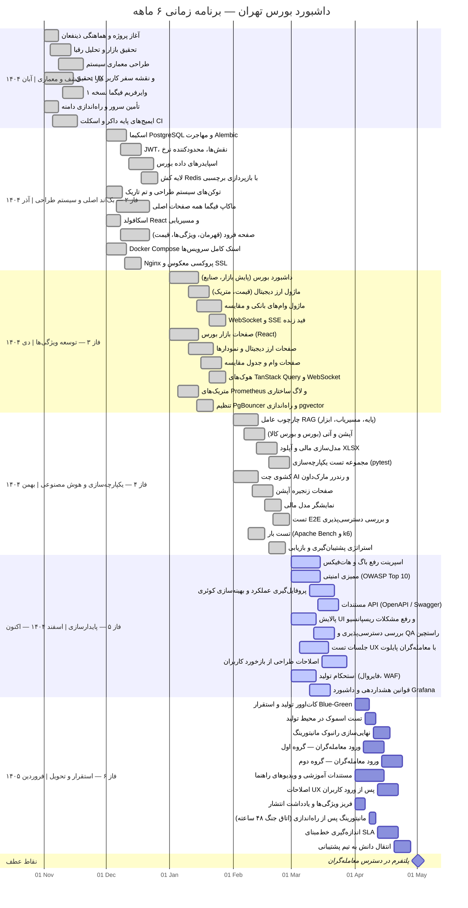

# داشبورد بورس تهران — برنامه پروژه و نمودار گانت

> گزارش جامع برنامه‌ریزی، تیم، هزینه و زمان‌بندی

---

## معرفی پروژه

**داشبورد TSE** یک اپلیکیشن وب تمام‌پشته و آماده برای محیط تولید است که برای پایش و تحلیل هوشمند بورس اوراق بهادار تهران، وام‌های بانکی، بازار ارز دیجیتال و پرتفوی سرمایه‌گذاری طراحی شده است.

این پلتفرم برای **معامله‌گران حرفه‌ای و تحلیل‌گران مالی** ساخته شده که به یک دیدگاه یکپارچه، داده‌محور و مبتنی بر هوش مصنوعی از بازارهای سرمایه ایران و جهان نیاز دارند.

---

## ماژول‌های اصلی سیستم

| ماژول | شرح |
|-------|-----|
| **پایش بازار بورس** | فید قیمت زنده، عمق سفارش، نقشه حرارتی صنایع، محدوده ۵۲ هفته |
| **تحلیل تکنیکال** | نمودارهای OHLCV، اندیکاتورهای RSI / MACD / بولینجر / ATR |
| **بازار ارز دیجیتال** | برترین ارزها، متریک‌های جهانی، مقایسه قیمت |
| **وام‌های بانکی** | محصولات وام بانک‌های ایرانی، شرایط، مقایسه نرخ سود |
| **چت هوش مصنوعی (RAG)** | پرسش و پاسخ طبیعی بر روی داده‌های بازار و اسناد آپلودشده |
| **آپشن و قراردادهای آتی** | زنجیره آپشن‌های بورس و بورس کالا، قراردادهای آتی IME |
| **مدل‌سازی مالی** | آپلود فایل XLSX، تحلیل مالی هوشمند با جمینای ۲.۵ |
| **احراز هویت و نقش** | JWT با دسترسی چهارسطحی: عمومی / بیننده / تحلیل‌گر / ادمین |

---

## پشته فناوری

| لایه | فناوری |
|------|--------|
| **API** | FastAPI 0.111 + Gunicorn + Uvicorn (ناهمزمان) |
| **پایگاه داده** | PostgreSQL 16 + pgvector (جستجوی معنایی) |
| **کش** | Redis 7 — بازپردازی با برچسب، محدودکننده نرخ |
| **استخر اتصال** | PgBouncer (transaction-mode pooling) |
| **پروکسی معکوس** | Nginx (gzip، محدودیت نرخ، کش استاتیک) |
| **فرانت‌اند** | React 18 + Vite + Mantine v7 |
| **هوش مصنوعی** | GPT-4o-mini (مسیریاب)، GPT-4o (RAG)، Gemini 2.5 Flash (مالی) |
| **زیرساخت** | Docker Compose، Dockerfile چندمرحله‌ای |
| **مشاهده‌پذیری** | متریک‌های Prometheus، لاگ ساختارمند JSON، ردیابی X-Request-ID |

---

## تیم پروژه

| نقش | مسئولیت | هزینه ماهانه (تقریبی) |
|-----|---------|----------------------|
| **مدیر محصول** | نیازسنجی، برنامه‌ریزی اسپرینت، هماهنگی ذینفعان، تأیید QA | ۷۰ میلیون تومان |
| **طراح UI/UX** | وایرفریم فیگما، سیستم طراحی، توکن‌های تم تاریک، چیدمان RTL | ۶۰ میلیون تومان |
| **توسعه‌دهنده بک‌اند** | مسیرهای FastAPI، مدل‌های ORM، عوامل RAG، کش، احراز هویت | ۸۰ میلیون تومان |
| **توسعه‌دهنده فرانت‌اند** | کامپوننت‌های React، هوک‌های TanStack Query، WebSocket | ۷۰ میلیون تومان |
| **DevOps / شبکه** | Docker، Nginx، CI/CD، تأمین سرور، مانیتورینگ، SSL | ۷۰ میلیون تومان |
| **جمع کل** | | **۳۵۰ میلیون تومان / ماه** |

---

## خلاصه مالی پروژه

| دوره | مدت | هزینه |
|------|-----|-------|
| **توسعه فعال** (فازهای ۱ تا ۴) | ۴ ماه | ~۱,۴۰۰ میلیون تومان |
| **سربار راه‌اندازی اولیه و ابزارها** | — | ~۱۰۰ میلیون تومان |
| **هزینه کل تاکنون** | | **~۱,۵۰۰ میلیون تومان (۱.۵ میلیارد)** |
| **پایدارسازی و استقرار** (فازهای ۵ و ۶) | ۲ ماه | ~۷۰۰ میلیون تومان |
| **بافر / اضطراری** | — | ~۳۰۰ میلیون تومان |
| **بودجه باقی‌مانده** | | **~۱,۰۰۰ میلیون تومان (۱ میلیارد)** |
| **جمع کل پروژه** | ۶ ماه | **~۲,۵۰۰ میلیون تومان (۲.۵ میلیارد)** |

> **فازهای ۵ و ۶** دوره «توقف توسعه جدید» هستند — سرعت ویژگی‌سازی کاهش یافته؛ تمرکز بر استحکام، ممیزی امنیتی، تست پذیرش کاربر و ورود معامله‌گران است. تیم کامل باقی می‌ماند و هزینه ماهانه ۳۵۰ میلیون تومان ثابت است.

---

## تبدیل تقویم شمسی به میلادی

| ماه شمسی | ماه میلادی | فاز |
|----------|-----------|-----|
| آبان ۱۴۰۴ | نوامبر ۲۰۲۵ | فاز ۱ |
| آذر ۱۴۰۴ | دسامبر ۲۰۲۵ | فاز ۲ |
| دی ۱۴۰۴ | ژانویه ۲۰۲۶ | فاز ۳ |
| بهمن ۱۴۰۴ | فوریه ۲۰۲۶ | فاز ۴ |
| اسفند ۱۴۰۴ | مارس ۲۰۲۶ | فاز ۵ ← اکنون |
| فروردین ۱۴۰۵ | آوریل ۲۰۲۶ | فاز ۶ |
| اردیبهشت ۱۴۰۵ | مه ۲۰۲۶ | راه‌اندازی برای معامله‌گران |

---

## خلاصه فازها

| فاز | ماه شمسی | تمرکز | وضعیت |
|-----|----------|-------|--------|
| **فاز ۱ — کشف و معماری** | آبان ۱۴۰۴ | نیازسنجی، طراحی سیستم، تحقیق UI/UX | تمام‌شده |
| **فاز ۲ — بک‌اند اصلی و طراحی** | آذر ۱۴۰۴ | اسکیما DB، احراز هویت، API پایه، ماکاپ فیگما | تمام‌شده |
| **فاز ۳ — توسعه ویژگی‌ها** | دی ۱۴۰۴ | تمام ماژول‌های اصلی (بورس، کریپتو، وام، RAG) | تمام‌شده |
| **فاز ۴ — یکپارچه‌سازی و هوش مصنوعی** | بهمن ۱۴۰۴ | چت AI، آپشن، مدل‌سازی مالی، تست E2E | تمام‌شده |
| **فاز ۵ — پایدارسازی** | اسفند ۱۴۰۴ | رفع باگ، بهینه‌سازی، ممیزی امنیتی | در جریان |
| **فاز ۶ — استقرار و تحویل** | فروردین ۱۴۰۵ | راه‌اندازی تولید، ورود معامله‌گران | پیش‌رو |
| **راه‌اندازی برای معامله‌گران** | اردیبهشت ۱۴۰۵+ | پلتفرم در دسترس همه معامله‌گران | پیش‌رو |

---

## نمودار گانت

> تاریخ‌های محور در قالب میلادی نمایش داده می‌شوند (محدودیت فنی Mermaid).
> جدول تبدیل شمسی در بخش بالا موجود است.

---

## تقسیم‌کار به تفکیک نقش

### مدیر محصول
- برنامه‌ریزی اسپرینت‌های ۲ هفته‌ای و مدیریت بک‌لاگ
- ارائه به ذینفعان و تأیید نیازمندی‌ها
- هماهنگی QA و تست پذیرش کاربر (UAT) با معامله‌گران پایلوت
- برنامه ورود معامله‌گران و مواد آموزشی
- تصمیم‌گیری Go/No-Go در هر دروازه فاز

### طراح UI/UX
- فایل کامل فیگما: وایرفریم ← ماکاپ Hi-Fi ← نمونه اولیه تعاملی
- سیستم طراحی: توکن‌های rallyColors، تم تاریک، قوانین چیدمان RTL
- فهرست کامپوننت‌ها (فرود، داشبورد، چت، فرم‌ها)
- جلسات تست کاربردپذیری با ۵ معامله‌گر پایلوت
- یادداشت‌های تحویل برای توسعه‌دهنده فرانت‌اند

### توسعه‌دهنده بک‌اند
- اپلیکیشن FastAPI: بیش از ۴۰ endpoint REST، WebSocket، SSE
- مدل‌های ORM SQLAlchemy و مهاجرت‌های Alembic
- کش Redis (مبتنی بر برچسب) و محدودکننده نرخ (پنجره لغزان)
- احراز هویت JWT با کنترل دسترسی مبتنی بر نقش (۴ سطح)
- خط لوله عامل RAG: مسیریاب نیت ← توزیع ابزار ← LLM ← پاسخ
- اسپایدرهای داده: بورس تهران، آپشن، بورس کالا، اسناد کدال
- مجموعه تست یکپارچه‌سازی (pytest، httpx، asyncpg)
- متریک‌های Prometheus، لاگ JSON ساختاری، ردیابی X-Request-ID

### توسعه‌دهنده فرانت‌اند
- SPA با React 18 + Vite، مسیرهای lazy-load و error boundary
- صفحات فرود: قهرمان، ویژگی‌ها، قیمت‌گذاری، آموزش، درباره
- داشبوردهای بازار: بورس، کریپتو، وام — همه با TanStack Query
- کشوی چت AI با رندرر مارک‌داون جریانی
- هوک WebSocket با اتصال مجدد خودکار برای فید قیمت زنده
- نمای زنجیره آپشن، آپلودکننده و نمایشگر مدل مالی
- چیدمان ریسپانسیو، تم Mantine v7، انیمیشن‌های Motion

### DevOps / شبکه
- بیلد داکر چندمرحله‌ای (targetهای api / scheduler / nginx)
- ارکستراسیون Docker Compose: nginx، app، scheduler، db، pgbouncer، redis
- تنظیم PostgreSQL 16 برای ۴ گیگابایت RAM + SSD + pgvector
- Nginx: gzip، محدودیت نرخ، کش دارایی استاتیک (۷ روز)، SSL
- خط لوله CI/CD (lint، test، build، deploy)
- تست بار (Apache Bench، k6) و مستندات بنچمارک
- فایروال تولید، WAF، استراتژی پشتیبان‌گیری، بازیابی از فاجعه
- استک مانیتورینگ Grafana + Prometheus

---

## ثبت ریسک‌ها

| ریسک | احتمال | تأثیر | راه‌حل |
|------|--------|-------|--------|
| تغییر یا قطعی API داده بورس | متوسط | بالا | لایه انتزاع اسپایدر؛ fallback به داده کش‌شده |
| هزینه زیاد API مدل‌های LLM | متوسط | متوسط | محدودیت توکن، کش پاسخ، مسیریابی مدل ارزان‌تر برای کوئری‌های ساده |
| مشکل عملکرد PostgreSQL زیر بار | کم | بالا | PgBouncer، کوئری ایندکس‌شده، کش Redis |
| محدودیت‌های قانونی / دسترسی به بورس | کم | بالا | داده از فیدهای عمومی بازار تأمین می‌شود |
| تغییر محدوده از بازخورد معامله‌گران | بالا | متوسط | فریز ویژگی پس از فاز ۵؛ درخواست‌های جدید ← نسخه بعدی |
| عدم دسترسی عضو تیم | کم | بالا | مستندات کامل کدبیس، CLAUDE.md، رانبوک‌ها |

---

## تعریف پایان پروژه

یک فاز زمانی کامل است که تمام موارد زیر برقرار باشد:

- [ ] تمام تیکت‌های برنامه‌ریزی‌شده به `develop` مرج شده‌اند
- [ ] پوشش تست >= ۸۰٪ برای ماژول‌های جدید
- [ ] تأیید مدیر محصول روی معیارهای پذیرش ویژگی
- [ ] بررسی UX پاس شده (بدون مشکل P0/P1 طراحی)
- [ ] هیچ باگ بحرانی باز (P0) وجود ندارد
- [ ] DevOps: بررسی سلامت سرویس در staging سبز است

**معیارهای راه‌اندازی (پایان فاز ۶):**

- [ ] تمام ۶ معیار بالا در **محیط تولید** برقرار باشد
- [ ] مانیتورینگ اتاق جنگ ۴۸ ساعته بدون حادثه P0 تمام شده باشد
- [ ] حداقل ۱۰ معامله‌گر پایلوت ورود پیدا کرده و فعال باشند
- [ ] خط‌مبنای SLA: تأخیر p99 API < 500 میلی‌ثانیه
- [ ] رانبوک به تیم پشتیبانی تحویل داده شده باشد

---

## نقشه راه پس از راه‌اندازی (پیشنهادی)

پس از اینکه معامله‌گران شروع به استفاده از پلتفرم کردند، اولویت‌های پیشنهادی بعدی:

۱. **ردیاب پرتفوی** — دارایی‌های شخصی، سود/زیان، نمودار تخصیص
۲. **هشدارهای قیمتی** — اطلاع‌رسانی ایمیل/تلگرام روی رسیدن به آستانه
۳. **PWA موبایل** — اپلیکیشن وب پیشرفته با قابلیت آفلاین
۴. **پشتیبانی چندزبانه** — بومی‌سازی کامل فارسی و RTL
۵. **اسکرینر پیشرفته** — سازنده فیلتر سفارشی برای نمادهای بورس

---

*تاریخ تهیه: ۲۰ اسفند ۱۴۰۴ | شاخه: develop | مخزن: sajjadtzroo/TSE_Dashboard*
