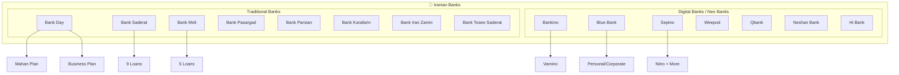

# 🏦 Iranian Banks Database

> [!info] Overview
> This vault contains comprehensive information about Iranian banks and their loan products, organized for easy navigation and relationship mapping.

## 📊 Statistics

| Category | Count |
|----------|-------|
| Total Banks | 15 |
| Traditional Banks | 8 |
| Digital Banks (Neo Banks) | 7 |
| Total Loan Products | 43 |

---

## 🗂️ Structure Map



---

## 🏛️ Traditional Banks

| Bank | Persian Name | Loans | Link |
|------|-------------|-------|------|
| [[Bank-Day]] | بانک دی | 2 | [Website](https://day24.ir) |
| [[Bank-Saderat]] | بانک صادرات | 9 | [Website](https://bsi.ir) |
| [[Bank-Meli]] | بانک ملی | 5 | [Website](https://bmi.ir) |
| [[Bank-Pasargad]] | بانک پاسارگاد | 3 | [Website](https://bpi.ir) |
| [[Bank-Parsian]] | بانک پارسیان | 6 | [Website](https://parsian-bank.ir) |
| [[Bank-Karafarin]] | بانک کارآفرین | 5 | [Website](https://karafarinbank.ir) |
| [[Bank-Iran-Zamin]] | بانک ایران زمین | 9 | [Website](https://izbank.ir) |
| [[Bank-Tosee-Saderat]] | بانک توسعه صادرات | 1 | - |

---

## 📱 Digital Banks (Neo Banks)

| Bank | Persian Name | Parent Bank | Loans | Link |
|------|-------------|-------------|-------|------|
| [[Bankino]] | بانکینو | بانک خاورمیانه | 2 | [Website](https://bankino.ir) |
| [[Blue-Bank]] | بلوبانک | بانک سامان | 0 | [Website](https://blu.ir) |
| [[Sepino]] | سپینو | بانک صادرات | 1 | [Website](http://sepino.bsi.ir) |
| [[Weepod]] | ویپاد | - | 0 | [Website](https://weepod.ir) |
| [[Qbank]] | کیوبانک | - | 0 | [Website](https://qbank.ir) |
| [[Neshan-Bank]] | نشان بانک | - | 0 | - |
| [[Hi-Bank]] | های بانک | - | 0 | - |

---

## 🔗 Quick Links

- [[All-Loans]] - Complete list of all loan products
- [[Loan-Comparison]] - Compare loan terms and rates
- [[No-Guarantor-Loans]] - Loans without guarantor requirement
- [[Credit-Rating-Guide]] - Understanding credit ratings

---

## 📁 Folder Structure

```
banks-s3-organized/
├── traditional-banks/
│   ├── bank-day/
│   ├── bank-saderat/
│   ├── bank-meli/
│   ├── bank-pasargad/
│   ├── bank-parsian/
│   ├── bank-karafarin/
│   ├── bank-iran-zamin/
│   └── bank-tosee-saderat/
│
└── digital-banks/
    ├── bankino/
    ├── blue-bank/
    ├── sepino/
    ├── weepod/
    ├── qbank/
    ├── neshan-bank/
    └── hi-bank/
```

---

#banks #iran #loans #index
