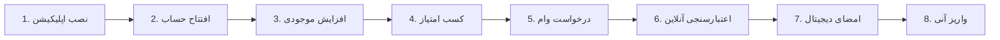

# 📱 Bankino (بانکینو)

> [!info] Bank Information
> - **Type:** Neo Bank (Digital)
> - **Parent Bank:** بانک خاورمیانه (Bank Khavarmiane)
> - **Website:** [bankino.ir](https://bankino.ir)
> - **Main Service:** وامینو (Vamino)

---

## ✨ Key Features

> [!success] Advantages
> - ✅ بدون ضامن (No Guarantor)
> - ✅ بدون چک و سفته (No Check/Promissory Note)
> - ✅ واریز آنی (Instant Deposit)
> - ✅ امضای دیجیتال (Digital Signature)
> - ✅ قابلیت خرید امتیاز
> - ✅ قابلیت انتقال رایگان امتیاز (سکه)

---

## 📊 Loan Details

### General Terms

| Property | Value |
|----------|-------|
| **Min Amount** | 10,000,000 تومان |
| **Max Amount** | 400,000,000 تومان |
| **Interest Rate** | 23% (مصوب بانک مرکزی) |
| **Repayment Period** | 6-24 months |

---

## 🎯 Scoring System (سیستم امتیازدهی)

> [!tip] How to Earn Points
> به ازای هر **۱۰۰ هزار تومان** که در حساب بماند، روزانه **۱ امتیاز** می‌گیرید.

### Loan Tiers by Points

| Amount | Points Required | Monthly Payment | Duration |
|--------|-----------------|-----------------|----------|
| 10M تومان | ~10,000 | ~1,800,000 تومان | 6 months |
| 20M تومان | ~24,000 | ~1,900,000 تومان | 12 months |
| 30M تومان | ~36,000 | - | 12 months |
| 50M تومان | ~60,000 | ~4,700,000 تومان | 12 months |
| 100M تومان | ~150,000 | ~6,600,000 تومان | 18-24 months |

> [!note] Tip
> اگر یک ضامن (که حساب بانکینو داشته باشد) معرفی کنید، امتیاز مورد نیاز کمتر می‌شود.

---

## 📋 Requirements

### Credit Requirements

| Requirement | Status |
|-------------|--------|
| Credit Rating | A or B |
| Bad Checks | ❌ Not allowed |
| Overdue Debts | ❌ Not allowed |
| Physical Documents | ❌ Not needed |

---

## 🔄 Application Process



### Step by Step (فارسی)

1. **نصب اپلیکیشن** و افتتاح حساب
2. **افزایش موجودی** برای کسب امتیاز
3. مراجعه به بخش **"وامینو"** در اپلیکیشن
4. **درخواست وام** و انجام اعتبارسنجی آنلاین
5. **امضای دیجیتال** قرارداد
6. **واریز آنی** وجه به حساب

---

## 📁 Loan Products

### 1. Vamino Monthly (وامینو - اعتبار یک ماهه)

Short-term credit facility.

**Files:**
- 📷 `وامینو.png`
- 📷 `Screenshot 2026-01-31 024119.png`

---

### 2. Vamino Installment (وامینو اقساطی)

Installment-based loan.

**Files:**
- 📷 `وامینو اقساطی.png`
- 📷 `Screenshot 2026-01-31 024119.png`

---

## 📁 Folder Structure

```
digital-banks/bankino/
├── metadata.json
├── data.json
├── Bankino.txt
├── Screenshot 2026-01-31 024119.png
└── loans/
    ├── vamino-monthly/
    │   ├── وامینو.png
    │   └── Screenshot.png
    └── vamino-installment/
        ├── وامینو اقساطی.png
        └── Screenshot.png
```

---

## 🔗 Related

- [[00-Banks-Index]]
- [[All-Loans]]
- [[No-Guarantor-Loans]]
- [[Weepod]] - Similar scoring system
- [[Blue-Bank]] - Another neobank

---

#bankino #neobank #digital-bank #no-guarantor #vamino
