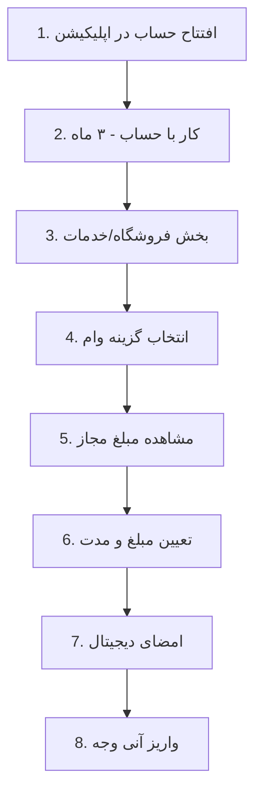

# 📱 Blue Bank (بلوبانک)

> [!info] Bank Information
> - **Type:** Neo Bank (Digital)
> - **Parent Bank:** بانک سامان (Bank Saman)
> - **Website:** [blu.ir](https://blu.ir)

---

## ✨ Key Features

> [!success] Advantages
> - ✅ بدون ضامن و وثیقه (No Guarantor/Collateral)
> - ✅ بدون چک و سفته (No Check/Promissory Note)
> - ⚡ واریز کمتر از ۱۰ دقیقه (Deposit < 10 min)
> - 💰 بخشش سود در تسویه زودتر (Early repayment benefit)

---

## 📊 Loan Types

### 1. Personal Loan (وام شخصی)

For all users based on account average.

| Property | Value |
|----------|-------|
| **Min Amount** | 3,000,000 تومان |
| **Max Amount** | 40,000,000 تومان |
| **Interest Rate** | 23% + کارمزد |
| **Repayment** | 6-12 months |
| **Criteria** | 3-month account average |

> [!tip] Formula
> سیستم به صورت خودکار میانگین موجودی ۳ ماه گذشته شما را بررسی می‌کند.
> معمولاً معادل **۵۰ تا ۱۰۰ درصد** میانگین حساب، وام تعلق می‌گیرد.

---

### 2. Corporate Loan (وام سازمانی)

For employees of partner companies.

| Property | Value |
|----------|-------|
| **Max Amount** | 200,000,000 تومان |
| **Repayment** | up to 24 months |
| **Eligibility** | Company employees only |

---

## 📋 Requirements

| Requirement | Details |
|-------------|---------|
| **Guarantor** | ❌ Not required |
| **Collateral** | ❌ Not required |
| **Check/Promissory** | ❌ Not required |
| **Credit Check** | ✅ Online (Bank Markazi) |
| **Bad Checks** | ❌ Must have none |
| **Overdue Payments** | ❌ Must have none |
| **Min Average** | 3,000,000 تومان |

> [!note] Money Not Blocked
> پول شما در حساب مسدود نمی‌شود و قابل برداشت است، اما اگر موجودی را خالی کنید، میانگین شما پایین آمده و مبلغ وام کم می‌شود.

---

## ✨ Special Features

### Early Repayment Benefit

> [!success] تسویه زودتر
> اگر وام را زودتر از موعد (مثلاً ماه اول) تسویه کنید، **سود ماه‌های آینده بخشیده می‌شود**.

### Fast Deposit

> [!tip] سرعت واریز
> کمتر از **۱۰ دقیقه** پس از تأیید

---

## 🔄 Application Process



---

## 📁 Files

| File | Type | Description |
|------|------|-------------|
| `blue.txt` | Text | Bank information |
| `*.html` | HTML | Rade.ir guide |
| `screenshots/*.jpg` | Images | App screenshots |
| `wepod_requirements.md` | Markdown | Requirements doc |

---

## 📁 Folder Structure

```
digital-banks/blue-bank/
├── data.json
├── blue.txt
├── افتتاح حساب بلوبانک...html
└── screenshots/
    ├── Screenshot_*.jpg (10 images)
    └── wepod_requirements.md
```

---

## 🔗 Related

- [[00-Banks-Index]]
- [[All-Loans]]
- [[No-Guarantor-Loans]]
- [[Bankino]] - Another neobank
- [[Sepino]] - Another neobank

---

#blue-bank #neobank #digital-bank #no-guarantor #bank-saman
