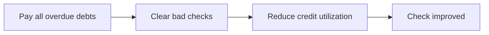

# 📊 Credit Rating Guide (راهنمای رتبه اعتباری)

> [!info] Overview
> Understanding credit ratings is essential for obtaining loans in Iran. This guide explains how ratings work and how to improve yours.

---

## 🏷️ Rating Scale

Iranian banks use a letter-based credit rating system:

| Rating | Status | Loan Eligibility |
|--------|--------|------------------|
| **A** | Excellent | ✅ All loans, best rates |
| **B** | Good | ✅ Most loans |
| **C** | Fair | ⚠️ Limited options |
| **D** | Poor | ❌ Most loans denied |
| **E** | Very Poor | ❌ No loans |

---

## ✅ What Affects Your Rating

### Positive Factors ⬆️

| Factor | Impact |
|--------|--------|
| On-time payments | ⭐⭐⭐ High |
| Long credit history | ⭐⭐ Medium |
| Low debt ratio | ⭐⭐ Medium |
| Stable income | ⭐ Low-Medium |
| Bank account activity | ⭐ Low |

### Negative Factors ⬇️

| Factor | Impact |
|--------|--------|
| **چک برگشتی** (Bad checks) | 💀 Severe |
| **قسط معوقه** (Overdue payments) | 💀 Severe |
| Multiple loan defaults | ⚠️ High |
| High debt-to-income | ⚠️ Medium |
| Recent credit applications | ⚠️ Low |

---

## 🏦 Rating Requirements by Bank

### Digital Banks (Neo Banks)

| Bank | Required Rating |
|------|-----------------|
| [[Bankino]] | A or B |
| [[Blue-Bank]] | A or B |
| [[Sepino]] | A or B (or salary proof) |
| [[Weepod]] | A or B |

### Traditional Banks

| Bank | Notes |
|------|-------|
| [[Bank-Day]] | Varies by loan amount |
| [[Bank-Saderat]] | Varies by product |
| [[Bank-Meli]] | Varies by product |
| [[Bank-Pasargad]] | Documented in branch |

---

## 🔍 How to Check Your Rating

### Online Methods

1. **استعلام اعتبارسنجی** through digital banking apps
2. **سامانه مرآت** (Central Bank system)
3. Bank branch inquiry

### What You Need

- National ID (کد ملی)
- Mobile number registered with your ID
- Bank account

---

## 📈 How to Improve Your Rating

### Short-term (1-3 months)

### Long-term (6-12 months)

| Action | Time to Impact |
|--------|----------------|
| Consistent on-time payments | 3-6 months |
| Build deposit history | 3-12 months |
| Maintain account activity | 1-3 months |
| Avoid new debt | Immediate |

---

## ⚠️ Common Mistakes

> [!warning] Avoid These
> 1. **Multiple applications** - Each check affects your score
> 2. **Ignoring small debts** - Even small amounts matter
> 3. **Closing old accounts** - Reduces credit history
> 4. **Maxing out credit** - High utilization hurts score
> 5. **Paying late** - Even by 1 day can affect rating

---

## 💡 Pro Tips

> [!tip] Best Practices
> - ✅ Set up auto-pay for all bills
> - ✅ Keep credit utilization below 30%
> - ✅ Maintain at least 2-3 active accounts
> - ✅ Check your rating before applying
> - ✅ Dispute errors immediately

---

## 📋 Rating Requirements by Loan Type

| Loan Type | Min Rating | Notes |
|-----------|------------|-------|
| No-guarantor digital | A-B | Strict |
| Credit cards | A-B | Moderate |
| Personal loans | B-C | With guarantor |
| Business loans | B+ | Documentation |
| Mortgage | B+ | Collateral helps |

---

## 🔗 Related

- [[00-Banks-Index]]
- [[All-Loans]]
- [[No-Guarantor-Loans]]
- [[Loan-Comparison]]

---

#credit-rating #guide #reference #eligibility
