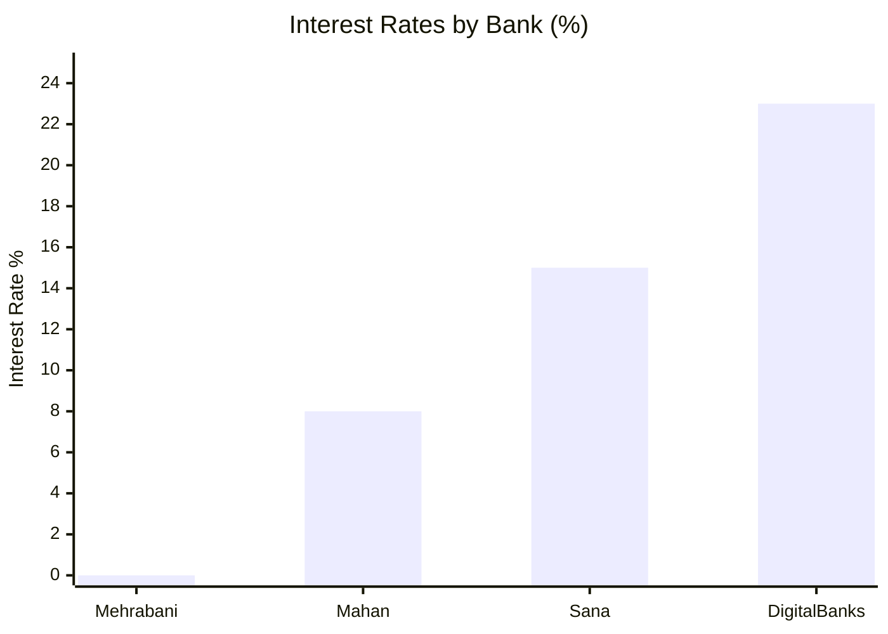

# 📊 Loan Comparison (مقایسه وام‌ها)

> [!info] Overview
> Compare all loan products side by side to find the best option for your needs.

---

## 🏆 Quick Recommendations

| Need | Best Option | Why |
|------|-------------|-----|
| **Lowest Interest** | [[Bank-Meli\|Mehrabani]] | 0% interest (with 1 guarantor) |
| **Highest Amount** | [[Bankino]] / [[Weepod]] | Up to 400M تومان |
| **No Guarantor** | [[Blue-Bank]] | Easiest approval |
| **Fastest** | [[Blue-Bank]] | < 10 min deposit |
| **Best Rate** | [[Bank-Day\|Mahan]] | 8% interest |

---

## 📱 Digital Banks Comparison

| Feature | [[Bankino]] | [[Blue-Bank]] | [[Sepino]] | [[Weepod]] |
|---------|------------|--------------|-----------|-----------|
| **Max Amount** | 400M | 40M | 300M | 400M |
| **Interest** | 23% | 23% | 15-23% | 23% |
| **Guarantor** | ❌ | ❌ | ❌ | ❌ |
| **Method** | Points | Average | Credit/Average | Points |
| **Min Wait** | Build points | 3 months | 2 months | Build points |
| **Parent Bank** | خاورمیانه | سامان | صادرات | - |

---

## 🏛️ Traditional Banks Comparison

| Feature | [[Bank-Day]] | [[Bank-Saderat]] | [[Bank-Meli]] | [[Bank-Pasargad]] |
|---------|-------------|-----------------|--------------|------------------|
| **Loans Count** | 2 | 9 | 5 | 3 |
| **Top Loan** | Mahan | Sana | Mehrabani | Cap Card |
| **Max Amount** | 1B | Varies | Varies | Varies |
| **Best Interest** | 8% | Varies | 0% | Varies |
| **Digital Branch** | ❌ | [[Sepino]] | ❌ | ❌ |

---

## 💰 Interest Rate Comparison

| Rank | Loan | Bank | Interest |
|------|------|------|----------|
| 🥇 | Mehrabani | Bank Meli | **0%** |
| 🥈 | Mahan | Bank Day | **8%** |
| 🥉 | Sana 2 | Sepino | **15%** |
| 4 | Most others | Various | **23%** |

---

## 📈 Maximum Amount Comparison

| Amount Range | Banks/Loans |
|--------------|-------------|
| **400M+ تومان** | [[Bankino]], [[Weepod]] |
| **200-400M** | [[Sepino]] (Sana), [[Blue-Bank]] (Corporate) |
| **100-200M** | [[Sepino]] (No Guarantor), [[Bankino]] |
| **40-100M** | [[Blue-Bank]] (Personal), Various |
| **<40M** | Most traditional bank products |

---

## ⏱️ Speed Comparison

| Speed | Banks | Notes |
|-------|-------|-------|
| **< 10 min** | [[Blue-Bank]] | Instant after approval |
| **Same day** | [[Bankino]], [[Sepino]] | Digital process |
| **1-3 days** | Traditional banks | Branch processing |
| **1+ week** | Complex loans | With guarantors |

---

## 📋 Requirements Comparison

### Digital Banks

| Requirement | Bankino | Blue Bank | Sepino |
|-------------|---------|-----------|--------|
| Guarantor | ❌ | ❌ | ❌ |
| Check | ❌ | ❌ | ❌ |
| Promissory Note | ❌ | ❌ | Digital |
| Credit Rating | A/B | A/B | A/B |
| Bad Checks | ❌ | ❌ | ❌ |
| Overdue Debts | ❌ | ❌ | ❌ |

### Traditional Banks

| Requirement | Day | Saderat | Meli |
|-------------|-----|---------|------|
| Guarantor | Sometimes | Usually | 1 (Mehrabani) |
| Average Period | 2-18 months | Varies | 1-12 months |
| Branch Visit | Yes | Yes | Yes |

---

## 🎯 Decision Flowchart

```mermaid
flowchart TD
    A[Need a Loan?] --> B{Have Guarantor?}
    B -->|No| C{Need > 40M?}
    B -->|Yes| D[Consider Traditional Banks]

    C -->|Yes| E[Bankino/Weepod - Build Points]
    C -->|No| F[Blue Bank - Fastest]

    D --> G{Want 0% Interest?}
    G -->|Yes| H[Bank Meli - Mehrabani]
    G -->|No| I{Want Low Rate?}
    I -->|Yes| J[Bank Day - Mahan 8%]
    I -->|No| K[Compare by Amount]
```

---

## 💡 Pro Tips

> [!tip] Strategy
> 1. **Start early**: Open accounts 3+ months before you need funds
> 2. **Spread deposits**: Keep money in multiple neobanks
> 3. **Monitor credit**: Check your credit rating regularly
> 4. **Compare fees**: Interest isn't everything - check fees too
> 5. **Early repayment**: Some banks waive remaining interest

> [!warning] Avoid
> - Applying with bad checks on record
> - Multiple applications in short time
> - Withdrawing all funds before applying

---

## 🔗 Related

- [[00-Banks-Index]]
- [[All-Loans]]
- [[No-Guarantor-Loans]]
- [[Credit-Rating-Guide]]

---

#comparison #loans #reference #decision-guide
