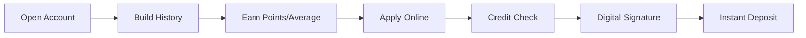

# 🎯 No Guarantor Loans (وام‌های بدون ضامن)

> [!success] Overview
> This page lists all loan products that **do not require a guarantor** (ضامن), making them easier to obtain.

---

## 📱 Digital Banks (Best Options)

Digital banks generally offer the easiest no-guarantor loans:

### [[Bankino]] - وامینو

| Feature | Details |
|---------|---------|
| **Max Amount** | 400M تومان |
| **Guarantor** | ❌ Not required |
| **Check/Promissory** | ❌ Not required |
| **Interest** | 23% |
| **Method** | Point-based scoring |

> [!tip] How to Qualify
> Earn points by keeping money in your account (1 point/day per 100K Toman)

---

### [[Blue-Bank]] - بلوبانک

| Feature | Details |
|---------|---------|
| **Max Amount** | 40M تومان (Personal) / 200M (Corporate) |
| **Guarantor** | ❌ Not required |
| **Collateral** | ❌ Not required |
| **Interest** | 23% + fees |
| **Method** | 3-month account average |

---

### [[Sepino]] - سپینو

| Feature | Details |
|---------|---------|
| **Max Amount** | 100M تومان |
| **Guarantor** | ❌ Not required |
| **Interest** | 23% |
| **Requirement** | A/B credit rating OR salary through Bank Saderat |

---

### [[Weepod]] - ویپاد

| Feature | Details |
|---------|---------|
| **Max Amount** | 400M تومان |
| **Guarantor** | ❌ Not required |
| **Method** | Point-based (similar to Bankino) |

---

## 🏛️ Traditional Banks

Some traditional banks also offer no-guarantor options:

### [[Bank-Meli]] - مهربانی ملی

| Feature | Details |
|---------|---------|
| **Guarantor** | ✅ **1 guarantor required** |
| **Interest** | 0% (zero!) |
| **Fee** | 0-4% |

> [!warning] Note
> This requires ONE guarantor but has **zero interest** - a good trade-off!

---

### [[Bank-Day]] - طرح ماهان

| Feature | Details |
|---------|---------|
| **Max Amount** | 1B تومان |
| **Guarantor** | Depends on amount |
| **Interest** | 8% |

> [!note]
> For loans over 5B Rials, 2-3 guarantors required.

---

## 📊 Comparison Table

| Bank | Type | Max Amount | Interest | Guarantor | Method |
|------|------|------------|----------|-----------|--------|
| [[Bankino]] | Digital | 400M | 23% | ❌ | Points |
| [[Blue-Bank]] | Digital | 40M | 23% | ❌ | Average |
| [[Sepino]] | Digital | 100M | 23% | ❌ | Credit Rating |
| [[Weepod]] | Digital | 400M | 23% | ❌ | Points |
| [[Bank-Meli\|Mehrabani]] | Traditional | - | 0% | ✅ (1) | Average |

---

## ✅ Requirements for No-Guarantor Loans

All no-guarantor loans typically require:

| Requirement | Status |
|-------------|--------|
| Valid National ID | ✅ Required |
| Bank Account | ✅ Required |
| Credit Rating (A/B) | ✅ Required |
| No Bad Checks | ✅ Required |
| No Overdue Debts | ✅ Required |
| Online Verification | ✅ Automatic |

---

## 🔄 Application Process

---

## 💡 Tips

> [!tip] Best Strategy
> 1. Open accounts in multiple neobanks
> 2. Split your savings across them
> 3. Build points/average in parallel
> 4. Apply when you need funds
> 5. Compare rates before choosing

---

## 🔗 Related

- [[00-Banks-Index]]
- [[All-Loans]]
- [[Loan-Comparison]]
- [[Bankino]]
- [[Blue-Bank]]
- [[Sepino]]

---

#no-guarantor #loans #digital-banks #comparison
